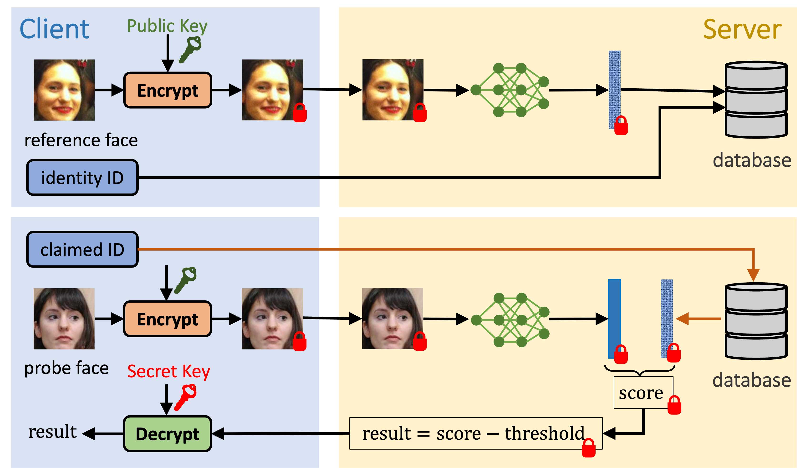

# CryptoFace: End-to-End Encrypted Face Recognition

Official implementation for *CryptoFace: End-to-End Encrypted Face Recognition*. The paper is presented at [CVPR 2025](https://openaccess.thecvf.com/content/CVPR2025/papers/Ao_CryptoFace_End-to-End_Encrypted_Face_Recognition_CVPR_2025_paper.pdf).

### ✨✨Repo Features✨✨

- **1️⃣ PyTorch Training **

- **2️⃣ Microsoft SEAL FHE Inference **

- **3️⃣ Seamless Pipeline:  → **



<details>
<summary><i>We encrypt face images to provide biometric and database security.</i></summary>
Face recognition is central to many authentication, security, and personalized applications. Yet, it suffers from significant privacy risks, particularly arising from unauthorized access to sensitive biometric data. This paper introduces CryptoFace, the first end-to-end encrypted face recognition system with fully homomorphic encryption (FHE). It enables secure processing of facial data across all stages of a face-recognition process—feature extraction, storage, and matching—without exposing raw images or features. We introduce a mixture of shallow patch convolutional networks to support higher-dimensional tensors via patch-based processing while reducing the multiplicative depth and, thus, inference latency. Parallel FHE evaluation of these networks ensures near-resolution-independent latency. On standard face recognition benchmarks, CryptoFace significantly accelerates inference and increases verification accuracy compared to the state-of-the-art FHE neural networks adapted for face recognition. CryptoFace will facilitate secure face recognition systems requiring robust and provable security. 
</details>

```angular2html
@inproceedings{ao2025cryptoface,
  title={{CryptoFace}: End-to-End Encrypted Face Recognition},
  author={Ao, Wei and Boddeti, Vishnu Naresh},
  booktitle = {CVPR},
  year = {2025},
  pages = {19197-19206},
  month = {June}
}
```

## Training Face Recognition Model with PyTorch

### Prepare Python Environment

```bash
conda create -n cryptoface python=3.9
conda activate cryptoface
pip install -U scikit-learn
pip install mxnet wandb tqdm 
conda install pytorch torchvision torchaudio pytorch-cuda=11.8 -c pytorch -c nvidia
pip uninstall numpy
pip install numpy==1.23.1
pip install einops
pip3 install multipledispatch
```

### Download Datasets

> Please download training dataset and evaluation datasets from [InsightFace](https://github.com/deepinsight/insightface). 

### Download Checkpoints or Train Face Recognition Model  

> You can download checkpoints from Google Drive.  

| Architecture    | Input Resolution | Parameters | Link |
|-----------------|------------------|------------|------|
| CryptoFaceNet4  | $64\times64$     | 0.94M      |[Google Drive](https://drive.google.com/drive/folders/1oEA6Z5k7c54Hbrk4HC8dhKjyzGFyDejA?usp=sharing) |
| CryptoFaceNet9  | $96\times96$     | 2.12M      |[Google Drive](https://drive.google.com/drive/folders/1Mst2GjCmEAlwk9razBxH1pgY-9gb90-h?usp=sharing) |
| CryptoFaceNet16 | $128\times128$   | 3.78M      | [Google Drive](https://drive.google.com/drive/folders/1WtU58I48ymCFP_4S1mmiBe0dt5FjHzdU?usp=sharing) |

> You can train models from scratch.  

```bash
python train.py config.yaml
```

## Inference: Encrypted Face Recognition with FHE

### Prepare C++ Environment for SEAL CKKS

> Install GMP

```bash
wget https://gmplib.org/download/gmp/gmp-6.3.0.tar.xz
tar -xf gmp-6.3.0.tar.xz
cd gmp-6.3.0
./configure
make
make check
sudo make install
```

> Install NTL

```bash
wget https://www.shoup.net/ntl/ntl-11.5.1.tar.gz
tar -xf ntl-11.5.1.tar.gz
cd ntl-11.5.1/src
./configure NTL_GMP_LIP=on
make
make check
sudo make install
```

> Install OpenMP 

```bash
sudo apt-get update
sudo apt-get install libomp-dev
```

> Compile and Install SEAL 

```bash
cd cnn_ckks/cpu-ckks/single-key/seal-modified-3.6.6
cmake -S . -B build
cmake --build build
sudo cmake --install build
```

> Compile CNNs 

```bash
cd cnn_ckks
cmake -S . -B build
cd build
make
```

### Prepare Model Weights for FHE Inference

> You can download off-the-shelf model weights for FHE Inference from [Google Drive](https://drive.google.com/drive/folders/1WAt7TFIf1UgbE-sFzYsspXIu8JGr7quD?usp=sharing). We provide all CKKS weights for CryptoFaceNets, AutoFHE and MPCNN. 

> You can use our script to transfer PyTorch weights to txt files.

```bash
python ckks.py config.yaml --output-dir <PATH>/ckks_model --ckpt-path <PATH>/model.ckpt
```

### Prepare Datasets for FHE Inference

> You can use our script to transfer evaluation dataset bin files to txt files. (input-size: 64, 96 or 128)

```bash
# Not patched images 
python datasets.py <PATH>/faces_emore -o <PATH>/faces_emore_patch --not-use-patch --input-size 64
``` 

```bash
# Patched images
python datasets.py <PATH>/faces_emore -o <PATH>/faces_emore_patch --use-patch --input-size 64
``` 


### Benchmark Face Recognition Models on Encrypted Face Datasets

> Benchmark baselines
./cnn [algorithm] [model] [dataset] [path_to_weight] [path_to_dataset] [path_to_output] [img_start_id] [img_end_id]

```bash
# MPCNN ResNet32 
mkdir <PATH>/ckks_result/mpcnn/resnet32
./cnn mpcnn resnet32 lfw 0 <PATH>/ckks_model <PATH>/faces_emore <PATH>/ckks_result 0 1

# MPCNN ResNet44
mkdir <PATH>/ckks_result/mpcnn/resnet44
./cnn mpcnn resnet44 lfw 0 <PATH>/ckks_model <PATH>/faces_emore <PATH>/ckks_result 0 1

# AutoFHE ResNet32
mkdir <PATH>/ckks_result/autofhe/resnet32
./cnn autofhe resnet32 lfw 0 <PATH>/ckks_model <PATH>/faces_emore <PATH>/ckks_result 0 1
```

> Benchmark CryptoFace
./cnn [algorithm] [input_size] [dataset] [path_to_weight] [path_to_dataset] [path_to_output] [img_start_id] [img_end_id]

```bash
# CryptoFace 64x64
mkdir <PATH>/ckks_result/cryptoface/64
./cnn cryptoface 64 lfw 0 <PATH>/ckks_model <PATH>/faces_emore_patch <PATH>/ckks_result 0 1

# CryptoFace 96x96
mkdir <PATH>/ckks_result/cryptoface/96
./cnn cryptoface 96 lfw 0 <PATH>/ckks_model <PATH>/faces_emore_patch <PATH>/ckks_result 0 1

# CryptoFace 128x128
mkdir <PATH>/ckks_result/cryptoface/128
./cnn cryptoface 128 lfw 0 <PATH>/ckks_model <PATH>/faces_emore_patch <PATH>/ckks_result 0 1
```

## Acknowledgement

The C++ implementation is built on top of 

[1] https://github.com/human-analysis/AutoFHE 

[2] https://github.com/snu-ccl/FHE-MP-CNN. 

The Python implementation of ArcFace Head and Evaluation Utils is from 

https://github.com/mk-minchul/AdaFace 
